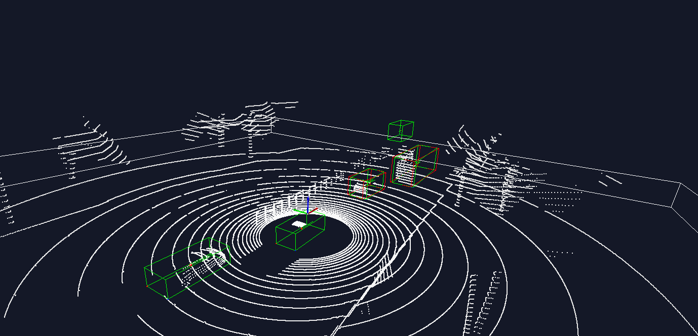

# PointPillars-Dss 

## Introduction 
3D object detection 모델 학습을 위한 베이스라인 코드 

### support model 
* [PointPillars](https://arxiv.org/pdf/1812.05784)
### support dataset 
* DssDataset

## Setup Environment 

```bash
# 1. create workspace
$ cd ~ && mkdir pointpillars-workspace && cd pointpillars-workspace 

# 2. clone repository 
$ git clone https://github.com/kjs2109/pointpillars-dss.git 

# 3. prepare dataset (you should have folder structure like below)
pointpillars-workspace
├── pointpillars-dss
└── DssDataset 
        ├── rawData
        └── labelingData

# 4. docker pull and run 
$ docker pull jusungkim/pointpillars-devel:v1.2
$ docker run -it --shm-size=8g --gpus all \
             --name pointpillars-workspace \
             -e DISPLAY=$DISPLAY -v /tmp/.X11-unix:/tmp/.X11-unix:rw \
             -v ./pointpillars-dss:/workspace/pointpillars-dss \
             -v ./DssDataset:/workspace/DssDataset \
             jusungkim/pointpillar-devel:v1.2  

# 5. setup and build 
$ cd /workspace/pointpillars-dss/ops
$ python setup.py develop 

# 6. prepare dss dataset
$ cd ..
$ python pre_process_dss.py  
```

## Quick Start

```bash
# train model 
$ python train.py --saved_path pillar_logs/exp1_test --batch_size 4 

# inference 
$ python utils/vis_o3d.py 

# experiment tracking 
$ tensorboard --logdir pillar_logs/{exp_name}/summary 

```
